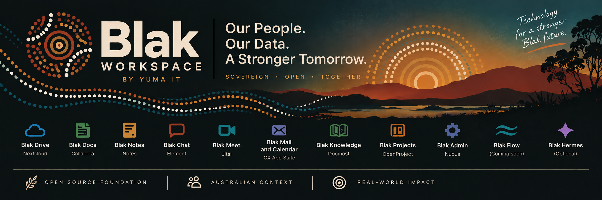

# Blak Workspace

Indigenous-branded digital workplace suite by Yuma IT, distributed as branding, configuration, deploy automation, documentation, and carefully scoped extensions on [openDesk](https://docs.opendesk.eu/operations/introduction/) (ZenDiS).

**Maturity: seed.** This repository is a project seed with backlog, architecture decisions, and overlay stubs. It is not a production deployment and does not implement the full suite.

## Purpose

Blak Workspace helps Australian organisations run a coherent digital workplace experience with Blak product naming on top of openDesk components, while preserving upstream compatibility and honest licensing. The [product contract](docs/product-contract.md) is the definition of done for this seed.

## Scope

**In scope**
- Branding and theming overlays
- Helmfile/Kubernetes configuration profiles (eval / staging / prod intent)
- Operator documentation and ADRs
- GitHub backlog for delivery
- Carefully scoped extensions that do not break upgrades

**Out of scope (this seed)**
- Deploying paid production infrastructure
- Claiming Microsoft 365 feature parity
- Invented community endorsements, cultural assets, or PROTECTED/IRAP certifications
- Relicensing upstream openDesk components

## Naming map (labels only)

| Blak label | Upstream component |
| --- | --- |
| Blak Workspace | openDesk suite |
| Blak Drive | OpenCloud |
| Blak Docs | Collabora |
| Blak Chat | Rocket.Chat |
| Blak Meet | Jitsi |
| Blak Mail and Calendar | OX App Suite (optional, if licensed) |
| Blak Knowledge | Outline (team wiki, OIDC via Blak ID) |
| Blak Projects | Kaneo |
| Blak Admin | Nubus admin / portal admin surfaces |
| Blak Flow | Blak Flow engine |
| Blak Hermes | Hermes agent runtime (opt-in sovereign AI / document search; default off) |

Internal chart and application IDs are not renamed.

## Quick start

1. Read the [product contract](docs/product-contract.md), [docs/assumptions.md](docs/assumptions.md), and [docs/upstream-baseline.md](docs/upstream-baseline.md).
2. Review ADRs under [docs/adr/](docs/adr/) — pivot: [ADR-014](docs/adr/ADR-014.md). Platform: [platform-overview](docs/architecture/platform-overview.md), [adapters](docs/architecture/adapters.md), [profiles](docs/architecture/profiles.md).
3. Validate backlog: `python scripts/validate-manifest.py`
4. Dry-run GitHub seed: `python scripts/seed-github.py --dry-run`
5. Explore deploy stubs under [deploy/](deploy/) (do not apply production). Eval intent: [deploy/profiles/eval/](deploy/profiles/eval/) and [deploy/PREREQS.md](deploy/PREREQS.md). Local K3s: [deploy/terraform](deploy/terraform/README.md).
6. Micro pivot: Compose `deploy/docker/micro.compose.yaml`; K3s `deploy/k3s/micro/`; Portal stub `apps/portal/`.

## Dedicated infrastructure

Blak Workspace targets production deployment on dedicated infrastructure. The
verified reference deployment uses single-node K3s; EKS needs an infrastructure
specific storage, registry, ingress and backup configuration.

Prepare a release for your actual domain before building or deploying. Checked-in
`workspace.example.com` URLs are templates. See the
[dedicated deployment runbook](docs/runbooks/dedicated-deployment.md).

Verified workflows include Blak ID SSO, files and sharing, Docs editing, team chat,
knowledge, projects, forms, private drawings, Frappe CRM and private Hermes sync.
Blak Knowledge uses Outline; Docmost was replaced because its SSO is licence-gated.

## Upstream baseline

Pinned discovery (2026-09-18 AEST): openDesk `v1.18.2` commit `eab2ee774187308f82307f0daaf1471dfe560f34` (2026-09-11).
See [docs/upstream-baseline.md](docs/upstream-baseline.md) for URLs, parallel line `v1.17.4`, and digest gaps.

## Attribution

openDesk is provided by ZenDiS GmbH. Component licences vary (AGPL, GPL, MPL, LGPL, MIT, Apache-2.0, and others). See [NOTICE](NOTICE), [THIRD_PARTY_NOTICES.md](THIRD_PARTY_NOTICES.md), and upstream documentation.

## Licence

Original Blak Workspace / Yuma overlay materials in this repository are licensed under the [Apache License, Version 2.0](LICENSE). This does not relicense upstream projects.
