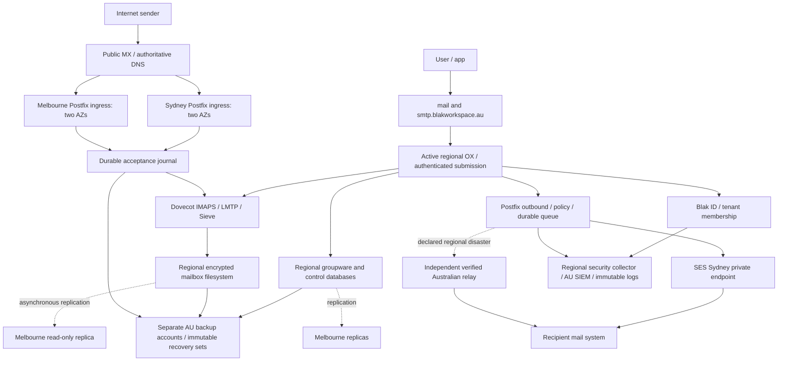

# Proposed architecture and data flows

Design proposal. All regional components below must pass the feature and account
checks in [availability](availability.md) before provisioning. Initial hosting is
EC2 with immutable, digest-pinned containers and systemd; avoids adding an EKS
control plane just for mail. Existing Helm deployments remain separate. Capacity
and instance families are selected by load tests, not fabricated mailbox counts.

Each region has at least two AZs, independent networking, regional KMS/Secrets
Manager, local images, monitoring and recovery access. Sydney is the only writable
mailbox/groupware region normally. Melbourne is warm standby with active inbound
gateways. Failover changes a fenced writer epoch; no active-active mailbox writes.

## Components and state

| Component | Persistence and HA | Boundary |
| --- | --- | --- |
| OX web/middleware | Two AZ application pools; supported OX MySQL schema; session/cache recovery tested | One OX context per tenant; no direct public provisioning APIs |
| Mail control API | PostgreSQL, explicit tenant keys/RLS; transactional operation outbox | Sole administrative authority for tenant objects |
| Identity | Existing Authentik protocol; regional application pools, replicated PostgreSQL state, same issuer | DR must not rely on Sydney for token validation or login |
| Postfix ingress/submission | Separate listeners/policies, encrypted durable queues, recoverable gateway identity | Only validated local recipients accepted inbound; submission requires auth |
| Dovecot | Maildir on Regional EFS candidate, one owner per mailbox, local rebuildable indexes | Vendor-supported NFS settings and locking/load tests mandatory |
| Full-text search | Supported Dovecot FTS backend, encrypted regional index, per-mailbox ACL checks | Derived data, rebuildable; never use unscoped global search |
| Databases | RDS MySQL for OX; RDS PostgreSQL for API/identity, Multi-AZ plus cross-region replica candidates | Engine versions, extension compatibility and encrypted replica support account-tested first |
| DNS | Two AU authoritative servers with distinct failure domains or contracted AU DNS | Public records only; no customer message identifiers |
| Archive/backup | S3 Object Lock + AWS Backup Vault Lock in separate backup accounts | Separate credentials, KMS keys, retention and restore roles |

EFS replication is a storage alternative to removed Dovecot CE replication, **not**
proof of supported mail HA. If OX/Dovecot support does not accept this combination,
evaluate supported Dovecot Pro storage under a separate ADR; no automatic downgrade
to end-of-support CE or invented S3 mailbox driver.

## Delivery paths

Inbound: DNS selects either region; Postfix validates recipient against tenant
directory and rejects unknown recipients during SMTP. After policy scanning, a
durability barrier must preserve RFC5322 bytes, envelope recipients and tenant IDs
before final `250`. Delivery uses LMTP to the fenced active mailbox owner. A second
MX must never blindly relay arbitrary domains or become a spam bypass.

The durable acceptance barrier is a **production gate**, not an implemented feature.
Ordinary Postfix spool plus asynchronous EFS/S3 replication cannot promise zero
loss of already-acknowledged messages. Qualify a mature journal/storage integration
that persists accepted messages in both Australian regions before acknowledgement,
or revise the zero-loss requirement explicitly. During declared single-region DR,
persist across surviving-region AZs before acknowledgement and record degraded
protection. Do not return success on a failed required durability write.

Outbound: users/apps submit only to `smtp.blakworkspace.au`; Postfix enforces sender
ownership and quotas, queues locally, then relays to SES Sydney. OX saves Sent
messages independently; test partial failures and retries. SES acceptance is not
recipient delivery. Feedback updates trace/suppression state asynchronously.

After Sydney failure: fence Sydney, promote Melbourne databases/identity/storage,
replay missing journal messages idempotently, validate ACLs, then expose OX/IMAP and
submission. Melbourne sends through an independently qualified Australian relay.
Without that relay, hold outbound mail and report degraded service, not successful
DR. On recovery, reseed Sydney from Melbourne; never merge two writable datasets.

## Network and deployment boundary

Only ports 25, 443, 465/587 and 993 are public where required. Databases, EFS, LMTP,
Sieve administration, provisioning and management stay private. Use regional load
balancers; SMTP terminates TLS at Postfix. Keep individual MX names addressable
through loss of one AZ. Separate gateway, application, storage and administration
security groups. Egress permits regional AWS endpoints, validated upstream mail
routes and approved update mirrors only. No CloudFront, foreign CDN, external
analytics, remote AI, tracking pixels or automatic foreign failover in mail UI.
