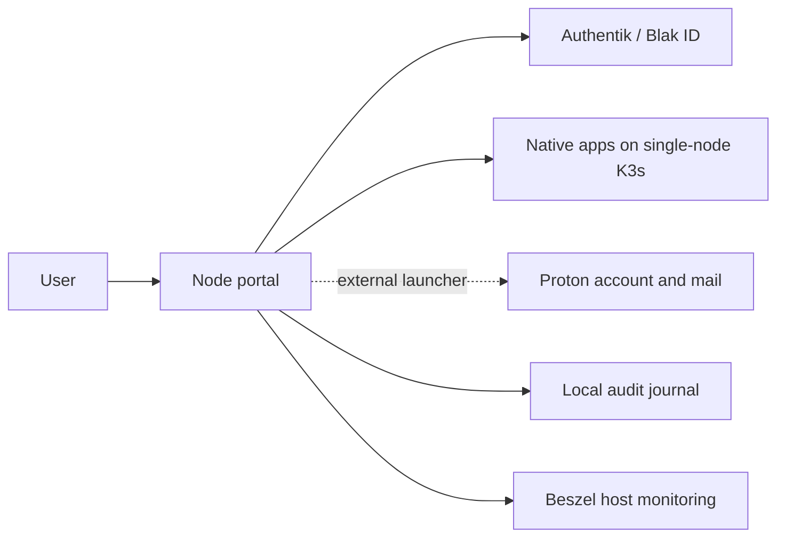

# Current state

Repository inspection, not a live cluster audit. The original checkout has extensive
unrelated changes; this work starts from fetched `origin/main` at `dc48d0e` in an
isolated worktree. Existing local changes and homelab objects remain untouched.

| Area | Evidence | Consequence |
| --- | --- | --- |
| Portal | `apps/portal/server.js`, Node HTTP server; `catalog.js`, `integration.js` | Not the Next.js portal described in old architecture intent |
| Mail | `catalog.js`, PRs #191/#192, `docs/product-contract.md` | External Proton launcher; no hosted OX/mailboxes or mail administration |
| Identity | `oidc.js`, `session-store.js`, `server.js` | Authentik OIDC, encrypted persistent sessions, claim refresh/revocation; subjects and `blak_id` exist |
| Roles | `app-roles.js`, `access-pages.js`, `blak-id-admin.js` | App roles and workspace-wide admin; no authenticated organisation membership contract for shared mail |
| Tenancy | `docs/architecture/fleet-isolation.md` | One organisation per deployment. Requested multi-tenant mail is a new boundary, not an existing guarantee |
| Audit | `access-guard.js` | Local JSONL/stdout fallback; not immutable regional audit delivery |
| Monitoring | `docs/runbooks/host-operations.md` | Beszel host monitoring. A SIEM destination/receipt contract is not established by that |
| Deployment | `deploy/k3s/micro`, dedicated-deployment runbook | Single-node suite, single-replica databases; does not provide regional HA |
| openDesk | `docs/upstream-baseline.md` | Pin v1.18.2; OX optional; Pro-only paths disabled. Latest vendor docs do not silently upgrade pin |
| Terraform | `deploy/terraform`, `deploy/terraform/eks` | Existing eval/gated deployment scaffolding; unsuitable as an assumed mail production platform |
| CI | `.github/workflows/validate.yml` | `validate / manifest` gate, no production credentials or apply. Existing workflow currently uses hosted runner; no new hosted workflow introduced |

Before mail UI is enabled, tenant membership must come from a verified server-side
directory, not `apps.includes('idp')`, an email suffix, an HTTP tenant header or a
request-body organisation ID. Existing app administrators receive no automatic
cross-tenant mail rights. Existing SSO must be made regionally survivable too.
