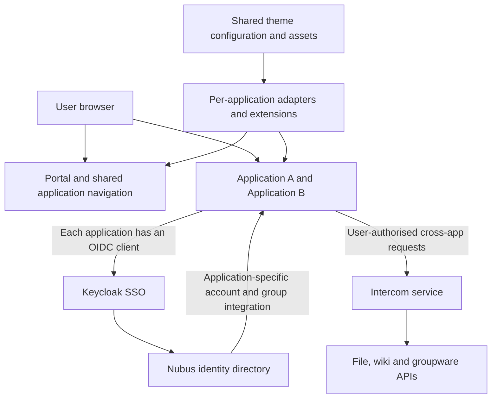

# How openDesk becomes one product — findings for Blak Workspace

Research date: 21 September 2026. Recommendation: keep Blak ID and the chosen applications; adopt an explicit integration contract covering identity, application launch, navigation, theme, account lifecycle and cross-application workflows.

## Evidence and limits

I inspected the public operations documentation and the actual deployment repository. The release baseline is **openDesk 1.17.4**, `main` commit `bd1b36f81f0982debf4e37c10ca890fb5b239fdb` (15 September 2026). I also inspected `develop` commit `b7f911b7cd3311b1f6fe51da4540ee74abc33e53` (20 September), then rechecked the core integration settings against the release baseline. Links below pin release code rather than a moving branch. This is source/configuration research, not a claim that I deployed or browser-tested openDesk. Context7 was attempted but its quota was exhausted; official documentation and first-party source were used directly.

The documentation is uneven: the architecture page still contains a SCIM roadmap dated 2025, and the linked Intercom manual explicitly says its UCS deployment instructions do not yet apply to Nubus on Kubernetes. Those statements are not evidence of a currently shipped, comprehensive SCIM implementation. The theming documentation links an old stylesheet path; the release code uses `helmfile/files/theme/portal/stylesheet.css`. Follow the pinned release configuration when the prose disagrees. [Architecture](https://docs.opendesk.eu/operations/architecture/), [Intercom manual scope](https://docs.software-univention.de/intercom-service/latest/index.html), [theming](https://docs.opendesk.eu/operations/theming/).

## The product integration has several distinct layers

Nubus supplies the identity directory and portal. Keycloak authenticates against the directory and establishes its SSO session. Each application is integrated separately. Application permissions, user provisioning, navigation and business-data connections have their own mechanisms; OIDC alone does not deliver them. [Architecture](https://docs.opendesk.eu/operations/architecture/).

The diagram is my synthesis of the sources, not a literal network topology. Individual components can delegate authentication to another component, such as an editor relying on its file host.

## What makes login feel seamless

A browser visiting application B without a B session can be redirected to the identity provider. If the identity-provider session already exists, another password entry is usually unnecessary. B receives an authorisation code, exchanges it, validates the response and establishes its own application session. Application A and B do not need to share an application cookie or accept the same token audience. A deep link must survive this round trip. `prompt=none` can request noninteractive authentication but must handle a failure requiring interaction. [OIDC code flow and authentication requests](https://openid.net/specs/openid-connect-core-1_0.html#CodeFlowAuth).

openDesk configures separate confidential clients, application scopes, redirect addresses and logout callbacks. In the inspected release, Intercom and applications including Nextcloud, OpenProject, XWiki, OX and Synapse have explicit back-channel logout destinations. Intercom has refresh-token and token-exchange settings. The bootstrap also maps named identity attributes, including `opendesk_username` and `opendesk_objectid`; mapping differs between applications. Some callback allowlists contain host-scoped wildcards, so the configuration should be studied rather than copied indiscriminately. [Keycloak bootstrap](https://gitlab.opencode.de/bmi/opendesk/deployment/opendesk/-/blob/bd1b36f81f0982debf4e37c10ca890fb5b239fdb/helmfile/apps/nubus/values-opendesk-keycloak-bootstrap.yaml.gotmpl).

OpenProject provides a particularly concrete example: the deployment sets `OPENPROJECT_OMNIAUTH__DIRECT__LOGIN__PROVIDER` to `keycloak`, requires login, configures the issuer and post-logout destination, and sets the home URL to the portal. That direct-login setting removes the otherwise redundant local login-provider choice. Its LDAP settings separately handle account/group synchronisation. [OpenProject configuration](https://gitlab.opencode.de/bmi/opendesk/deployment/opendesk/-/blob/bd1b36f81f0982debf4e37c10ca890fb5b239fdb/helmfile/apps/openproject/values.yaml.gotmpl).

**Implication for Blak:** “Continue with Blak ID works” and “launching any app opens the requested work immediately” are separate acceptance criteria. The latter requires a deliberate entry route or a native automatic-login setting for each application. Keep a controlled administrator recovery route; do not simulate login by injecting credentials or hiding a second password form with CSS.

## Access and account lifecycle are separate from login

openDesk manages coarse application access and group membership centrally, while fine-grained resource permissions remain primarily inside each application. Its documentation describes user attributes generating managed application groups; those memberships control portal visibility and the OIDC claims needed for access. Knowing an application URL should therefore not bypass the entitlement check. Direct group edits can be overwritten by attribute-based reconciliation. The documentation also warns that application integrations process direct memberships rather than nested groups. [Roles and permissions](https://docs.opendesk.eu/operations/permissions/).

For Blak, separate three questions: can this user authenticate, may they use this app, and may they read this particular file or record? Require all three in the relevant layer. Account creation, renaming, disabling and session revocation need their own verified workflows; a successful first OIDC login does not prove them. Preserve source permissions when exposing content through Search or Hermes.

## Navigation and cross-application authentication

The Nubus portal exposes central navigation, enabled with a server-side shared secret. The portal configuration also supplies newsfeed integration and an Intercom silent-login URL. [Nubus portal settings](https://gitlab.opencode.de/bmi/opendesk/deployment/opendesk/-/blob/bd1b36f81f0982debf4e37c10ca890fb5b239fdb/helmfile/apps/nubus/values-nubus.yaml.gotmpl).

Applications obtain navigation appropriate to the user. The documented backend endpoint is `/univention/portal/navigation.json`; browser integrations use Intercom's `/navigation.json`. This makes the launcher a product service rather than separately maintained links in every application. [Architecture: central navigation](https://docs.opendesk.eu/operations/architecture/#central-navigation).

The released Intercom configuration enables `tokenExchangeV2`, has its own confidential OIDC client, Redis session storage, and explicit downstream audiences for Nextcloud, XWiki and OX. Navigation uses a separate portal secret. It is therefore an authenticated backend integration service, not merely a menu script. [Intercom configuration](https://gitlab.opencode.de/bmi/opendesk/deployment/opendesk/-/blob/bd1b36f81f0982debf4e37c10ca890fb5b239fdb/helmfile/apps/nubus/values-intercom-service.yaml.gotmpl).

The upstream conceptual manual describes acquiring the Intercom session through hidden-iframe login after the app login. It also exposes `/silent` and `/backchannel-logout`; some downstream integrations can use shared secrets rather than OIDC. Its deployment-specific advice must be read with the Kubernetes limitation above. [Intercom architecture](https://docs.software-univention.de/intercom-service/latest/architecture.html).

For Blak, build user-specific navigation first. Add a narrowly scoped backend integration service only when a real workflow requires it. Keep shared service credentials and refresh tokens out of the browser. Test silent-session establishment across supported browsers and provide a normal interactive fallback; do not assume that an iframe always has access to an identity session.

## How applications consume the integration

| Application | Concrete release evidence | Lesson for Blak |
|---|---|---|
| Nextcloud | OIDC identity maps to `opendesk_objectid`; a management component configures central navigation and `integration_swp` theme options. | Use durable identity mapping and a maintained native integration point. |
| OpenProject | Direct Keycloak login; common navigation URL; seeded theme and portal home link. | Configure the application's real authentication and design settings. |
| XWiki | OIDC settings, RP-initiated logout, workplace navigation endpoint and LDAP attribute mapping. | Login, user profile and navigation require separate configuration. |
| Element | A named openDesk module receives navigation, silent-login, portal-logo and portal-home URLs, plus CSS variables. | A supported application extension can integrate the common header deliberately. |
| OX App Suite | Dedicated integration components, a public-sector navigation configuration and dynamic-theme settings. | Maintain app-specific integration rather than assuming all applications expose the same hooks. |

Sources: [Nextcloud management](https://gitlab.opencode.de/bmi/opendesk/deployment/opendesk/-/blob/bd1b36f81f0982debf4e37c10ca890fb5b239fdb/helmfile/apps/nextcloud/values-nextcloud-management.yaml.gotmpl), [OpenProject](https://gitlab.opencode.de/bmi/opendesk/deployment/opendesk/-/blob/bd1b36f81f0982debf4e37c10ca890fb5b239fdb/helmfile/apps/openproject/values.yaml.gotmpl), [XWiki](https://gitlab.opencode.de/bmi/opendesk/deployment/opendesk/-/blob/bd1b36f81f0982debf4e37c10ca890fb5b239fdb/helmfile/apps/xwiki/values.yaml.gotmpl), [Element](https://gitlab.opencode.de/bmi/opendesk/deployment/opendesk/-/blob/bd1b36f81f0982debf4e37c10ca890fb5b239fdb/helmfile/apps/element/values-element.yaml.gotmpl), [OX App Suite](https://gitlab.opencode.de/bmi/opendesk/deployment/opendesk/-/blob/bd1b36f81f0982debf4e37c10ca890fb5b239fdb/helmfile/apps/open-xchange/values-openxchange.yaml.gotmpl).

This is evidence of an integrated distribution. Do not assume a stock upstream image, another edition or another version offers every openDesk-specific extension. It is not a reason to replace Blak's chosen HeyForm, Excalidraw, Frappe CRM or OpenCloud without evaluating their actual integration contracts.

## How the consistent appearance is built

The theme source groups product name, slogan, colours, logos, favicons and application-specific artwork. Some colour entries are explicitly unused. It warns that base64 assets placed into ConfigMaps must fit Kubernetes' size limit. Therefore “change one theme file” is an organising principle with documented exceptions, not universal CSS inheritance. [Theme values](https://gitlab.opencode.de/bmi/opendesk/deployment/opendesk/-/blob/bd1b36f81f0982debf4e37c10ca890fb5b239fdb/helmfile/environments/default/theme.yaml.gotmpl).

A static-files component serves configured assets under application-specific hosts and paths, including login and portal images, Nextcloud logos and favicons. This gives existing applications predictable asset URLs. [Static-file routing](https://gitlab.opencode.de/bmi/opendesk/deployment/opendesk/-/blob/bd1b36f81f0982debf4e37c10ca890fb5b239fdb/helmfile/apps/opendesk-services/values-opendesk-static-files.yaml.gotmpl).

Per-app adapters then translate that theme: OpenProject seeds native design settings; OX sets dynamic-theme values; Element supplies extension CSS variables; Nextcloud receives theme settings and an intentional header override. Portal/login styling also has its own stylesheet with typography, spacing, states and colours. [Portal stylesheet](https://gitlab.opencode.de/bmi/opendesk/deployment/opendesk/-/blob/bd1b36f81f0982debf4e37c10ca890fb5b239fdb/helmfile/files/theme/portal/stylesheet.css), plus the application sources above.

**Blak design contract:** maintain one vector master, one palette, typography/spacing rules, common navigation placement, account menu behaviour, app naming and light/dark states. Generate each supported adapter from that contract. Prefer native design APIs, plugins and extension hooks. Where an upstream DOM/CSS workaround is unavoidable, name it, pin its supported version and test it after upgrades. A shared logo alone cannot establish a coherent product.

## Current Blak Workspace comparison

These are findings from the current checkout, not inferred defects in every deployed app.

| Area | Current evidence | Consequence and next action |
|---|---|---|
| Identity provider | `scripts/deploy/ak-portal.py`, `ak-outline.py` and `ak-hermes.py` create confidential Authentik providers. | Native app integration already has a foundation. Changing to Keycloak alone would not supply the missing product integration. |
| Subject identifiers | These scripts use `sub_mode: user_username`. | Plan an immutable identity contract. Migrate existing account links, drawings, workflows and search ownership before changing subjects; a blind change can create duplicate users or orphan content. |
| Secret lifecycle | Those setup scripts generate and assign a new client secret whenever run. | Make normal reconciliation idempotent; rotate explicitly and update consumers together. This is a deployment failure risk, not proof it caused every prior login error. |
| Launcher | `apps/portal/catalog.js` and `services/workspace-shell/apps.json` supply a static catalogue. The shell fetches public JSON. | Build a session-authenticated, entitlement-filtered navigation endpoint. Hidden menu entries are not an authorisation boundary; apps must still enforce access. |
| Logout | The portal's `/logout` handler in `apps/portal/server.js` clears the portal cookie and redirects home. | This handler alone does not establish suite-wide logout. Implement and test provider logout plus per-app session invalidation where supported. |
| Theme | `scripts/brand/generate.js` already centralises palette adapters; `services/workspace-shell/shell.js` applies local settings and DOM changes. Nginx injects the shared script/style. | Keep the shared source. Move important navigation and identity UI into supported integration hooks; retain explicit compatibility tests for remaining injection. |
| Public URLs | Tailnet publishing uses one hostname with different ports. | Continue generating callbacks, launch URLs and issuer settings from public deployment configuration. Test cookies as well as redirects. |
| Private content | Portal features and Hermes/Search sync already track owners. | Carry the immutable identity contract through these systems; never replace it with a shared administrator service identity. |

Local source links: [provider setup](../../scripts/deploy/ak-portal.py), [portal](../../apps/portal/server.js), [catalogue](../../apps/portal/catalog.js), [shared shell](../../services/workspace-shell/shell.js), [injection proxy](../../services/workspace-shell/nginx.conf), [theme generator](../../scripts/brand/generate.js), [sync](../../services/hermes-sync/sync.py).

One important infrastructure distinction: browser cookies are not isolated by TCP port. Separate tailnet ports are separate web origins but do not provide separate cookie-host boundaries. Audit cookie names, host/path scope and logout behaviour across the suite; do not interpret this as evidence that a collision was already observed. Longer term, evaluate distinct HTTPS hostnames through the private network while preserving reliable tailnet access. [RFC 6265, section 8.5](https://www.rfc-editor.org/rfc/rfc6265#section-8.5).

## Proposed implementation order

These are recommendations, not changes performed as part of this research.

1. **Define the application contract.** Extend the existing catalogue rather than create another registry. Record public origin, OIDC client/discovery URL, native login entry, callback and logout support, entitlement, identity mapping, theme adapter and supported version. Generate deployment values and navigation from the same data. Keep secrets in secret storage.
2. **Make one-login behaviour measurable.** Start a clean browser, authenticate once at Blak ID, open every app and a protected deep link. No additional password entry; use direct OIDC launch where supported. Record provider-choice screens separately from authentication failures. Verify issuer/audience validation, state/nonce and supported PKCE handling in each integration. Preserve administrator recovery access.
3. **Implement account lifecycle and logout.** Reconcile per-app accounts/roles with defined disablement latency. Test rename, suspension, group removal, expiry, logout and browser-back behaviour. Use SCIM only where the actual application/version supports it; otherwise maintain an explicit connector. Treat logout capability gaps as visible product limitations.
4. **Publish common authenticated navigation.** Derive the current identity server-side, return only permitted apps, preserve requested destinations and use one ordering/name/icon set. Provide a supported shared header or native launcher integration for each app. Never ship backend navigation secrets in JavaScript.
5. **Harden the theme contract.** Replace stale raster marks; align header, account controls, type scale, spacing, focus, errors and loading states. Test portal, Blak ID and each app at mobile/desktop sizes in both themes. Exercise open menus and dialogs, not just landing screenshots. Keep upstream attribution where required.
6. **Add useful cross-app workflows.** Start with links that preserve context: project-to-file, Knowledge-to-document and search-to-source. Add server-mediated pickers or API calls only where they eliminate a real user step. Evaluate Authentik's supported delegation/token-exchange capabilities before designing a Keycloak-style exchange dependency; do not assume equivalence.
7. **Gate releases on suite journeys.** Pin versions, run login and permission scenarios plus critical cross-app actions before promotion, and verify again on the live tailnet deployment. Include a second user and an account with restricted app access. A successful rollout or an HTTP 200 does not prove the product journey.

openDesk's own testing approach gives useful precedent: it targets central navigation, cross-app file picking, configuration variants and historical regressions, with nightly fresh-install/update/upgrade matrices. Reuse that focus while keeping Blak's test scope appropriate to its selected apps. [Testing strategy](https://docs.opendesk.eu/operations/testing/).

## Decision

Retain **Blak ID on Authentik** while validating each application's native OIDC capabilities. Invest first in reliable app launch, immutable identity mapping, lifecycle/logout, user-aware navigation and maintained theme adapters. Revisit the IdP only if a required, verified integration capability is unavailable or operationally unsuitable. openDesk demonstrates the value of the integration layer; its product cohesion is not obtained by installing Keycloak or applying a global stylesheet.
